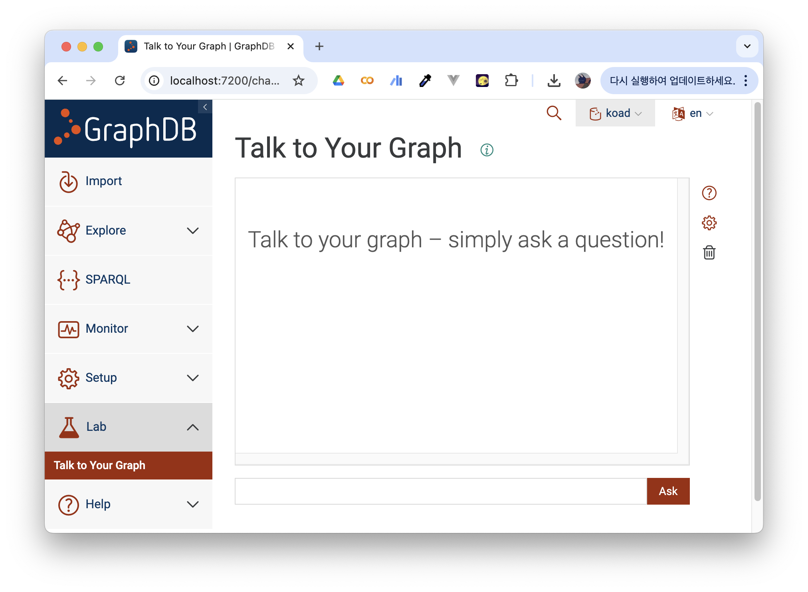

# 지식그래프에 자연어 질의하기 - GraphSparqlQAChain

GraphDB를 사용해 보면, 'Talk to your graph'이라는 기능을 시범적으로 서비스한다. 말 그대로 `자연어-> SPARQL쿼리-> 쿼리 실행 결과`과정으로, SPARQL 쿼리의 입력 없이 자연어로 직접 그래프를 탐색 할 수 있도록 하는 기능이다.



만약에 RAG chain을 구성하는데 지식그래프를 탐색한 결과를 사용하려면 어떻게 해야 할까? 

LangChain에서는 chain 상에서 그래프를 이용할 수 있는 다양한 패키지를 제공한다. graphg qa chain을 지원하는 외부 패키지들은 `langchain_community.chains.graph_qa`에서 제공된다. GraphSparqlQAChain도 그중 하나로, RDF 형식의 지식그래프를 지원하는 RDFLib 클래스와 호환되는 그래프 QA chain 패키지이다.

## 사용법

준비물은 탐색을 진행할 지식그래프의 파일(.ttl 형식의 트리플 파일이나 해당 형식의 데이터가 존재하는 웹 URL), 그리고 탐색에 사용할 LLM 모델의 API 키(또는 모델 자체)가 필요하다.

본문에서 사용한 langchain_community 의 버전은 0.3.19 이다. 업데이트된 경우 공식문서를 꼭 확인해야 한다. 

### 0. Library Import

```python
from langchain_community.chains.graph_qa.sparql import GraphSparqlQAChain
from langchain_community.graphs.rdf_graph import RdfGraph
from langchain_openai import ChatOpenAI # 또는 다른 모델도 가능
from langchain_core.prompts import PromptTemplate
```

여기서는 API 키가 이미 `.env`에 정의되어 있다는 전제로 진행한다.

### 1. Graph Define

탐색이 진행될 그래프를 `RdfGraph` 타입의 객체로 선언한다. 

```python
graph = RdfGraph(
    source_file="<.ttl 파일 경로 입력>.ttl", # 또는 rdf 형식의 데이터가 존재하는 url
    standard="rdf", # 그래프 데이터가 어떤 표준을 따르고 있는지 (rdf, rdfs, owl 중 선택)
    local_copy="test.ttl" # 그래프 데이터에 수정이 존재할 경우 수정된 파일을 저장할 경로
)
```

그래프를 잘 가져왔는지 확인해보자

```python
graph.get_schema
```

에러가 뜨지 않고 그래프에 정의된 IRI들이 잘 나오면 성공적으로 로드해온 것이다.

```
'In the following, each IRI is followed by the local name and optionally its description in parentheses. \nThe RDF graph supports the following node types:~~~'
```

### 2. Prompt Define

GraphSparqlQAChain에서는 기본적인 생성자로 QA를 진행하는 체인(`qa_chain`),쿼리를 선택하도록 하는 체인(`sparql_select_chain`), 그래프를 업데이트 하는 체인(`sparql_update_chain`), 질의문을 통해 적절한 SPARQL 쿼리 유형을 결정하도록 하는 체인(`sparql_intent_chain`)을 매개 변수로 정의해야 한다. 하지만, 이를 실제로 LLMChain 타입으로 구현하는 것은 복잡하고 번거롭다. 

이에 GraphSparqlQAChain에서는 프롬프트만으로 각각의 체인들을 자동으로 생성해주는 내장 함수 `.from_llm()`을 지원한다. `from_llm`에서는 앞서 언급한 각각의 기능을 수행하도록 지시하는 프롬프트들을 매개변수로 정의한다.

프롬프트는 아래 예시와 같이 입력할 수 있다. 필요에 따라 아래 예시를 변경해 사용할 수 있지만, 그냥 그대로 복붙에서 사용해도 꽤 만족스러운 결과를 얻을 수 있다.

:::details Prompt 예시
```python
qa_prompt = PromptTemplate(
    input_variables=['context', 'prompt'],
    template="Task: Generate a natural language response from the results of a SPARQL query.\n"
             "You are an assistant that creates well-written and human-understandable answers.\n"
             "The information part contains the information provided, which you can use to construct an answer.\n"
             "The information provided is authoritative, you must never doubt it or try to use your internal knowledge to correct it.\n"
             "Make your response sound like the information is coming from an AI assistant, but don't add any information.\n\n"
             "Information:\n{context}\n\n"
             "Question: {prompt}\n"
             "Helpful Answer:"
)


sparql_select_prompt = PromptTemplate(
    input_variables=['prompt', 'schema'],
    template="Task: Generate a SPARQL SELECT statement for querying a graph database.\n"
             "For instance, to find all email addresses of John Doe, the following query would be suitable:\n"
             "PREFIX foaf: <http://xmlns.com/foaf/0.1/>\n"
             "SELECT ?email\n"
             "WHERE {{\n"  # ← 여기를 `{{` 로 변경
             "    ?person foaf:name \"John Doe\" .\n"
             "    ?person foaf:mbox ?email .\n"
             "}}\n\n"  # ← 여기도 `}}` 로 변경
             "Instructions:\n"
             "Use only the node types and properties provided in the schema.\n"
             "Do not use any node types and properties that are not explicitly provided.\n"
             "Include all necessary prefixes.\n"
             "Schema:\n{schema}\n\n"
             "The question is:\n{prompt}"
)

sparql_update_prompt = PromptTemplate(
    input_variables=['prompt', 'schema'],
    template="Task: Generate a SPARQL UPDATE statement for updating a graph database.\n"
             "For instance, to add 'jane.doe@foo.bar' as a new email address for Jane Doe, the following query would be suitable:\n"
             "PREFIX foaf: <http://xmlns.com/foaf/0.1/>\n"
             "INSERT {{\n"
             "    ?person foaf:mbox <mailto:jane.doe@foo.bar> .\n"
             "}}\n"
             "WHERE {{\n"
             "    ?person foaf:name \"Jane Doe\" .\n"
             "}}\n\n"
             "Instructions:\n"
             "Schema:\n{schema}\n\n"
             "The information to be inserted is:\n{prompt}"
)

sparql_intent_query = PromptTemplate(
    input_variables=['prompt'],
    template="Task: Identify the intent of a prompt and return the appropriate SPARQL query type.\n"
             "You are an assistant that distinguishes different types of prompts and returns the corresponding SPARQL query types.\n\n"
             "Consider only the following query types:\n"
             "* SELECT: this query type corresponds to questions\n"
             "* UPDATE: this query type corresponds to all requests for deleting, inserting, or changing triples\n\n"
             "Note: Be as concise as possible.\n"
             "Do not include any explanations or apologies in your responses.\n"
             "Do not respond to any questions that ask for anything else than for you to identify a SPARQL query type.\n"
             "Do not include any unnecessary whitespaces or any text except the query type, i.e., either return 'SELECT' or 'UPDATE'.\n\n"
             "The prompt is:\n{prompt}\n"
             "Helpful Answer:"
)
```
:::

### 3. Create GraphSparqlQAChain

이제 chain을 생성해보도록 하자. llm의 temperature는 가급적 0으로 설정하는 것을 권장한다.
반드시 `allow_dangerous_requests`를 True로 설정해야 한다. 

```python
g_chain =  GraphSparqlQAChain.from_llm(
    llm=ChatOpenAI(temperature=0),
    qa_prompt=qa_prompt,
    graph=graph,
    sparql_select_prompt=sparql_select_prompt,
    sparql_update_prompt=sparql_update_prompt,
    sparql_intent_query=sparql_intent_query,
    allow_dangerous_requests=True   
)
```

## 이제 사용해보기

기본적인 chain 클래스들처럼 `invoke`를 사용해서 질의를 입력할 수 있다. 

```python
g_chain.invoke({"query" : ' 그래프에 질의할 내용 '})
```

## 참고자료
- [Langchain API References - RdfGraph](https://api.python.langchain.com/en/latest/community/graphs/langchain_community.graphs.rdf_graph.RdfGraph.html#langchain_community.graphs.rdf_graph.RdfGraph)
- [Langchain API References - GraphSparqlQAChain](https://api.python.langchain.com/en/latest/community/chains/langchain_community.chains.graph_qa.sparql.GraphSparqlQAChain.html#langchain_community.chains.graph_qa.sparql.GraphSparqlQAChain.sparql_intent_chain)