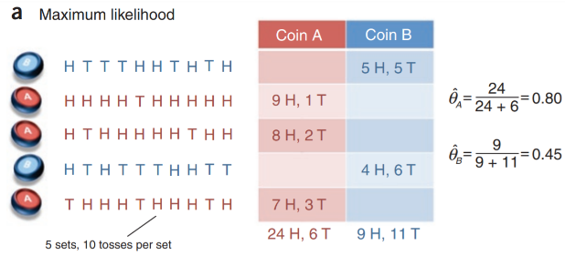
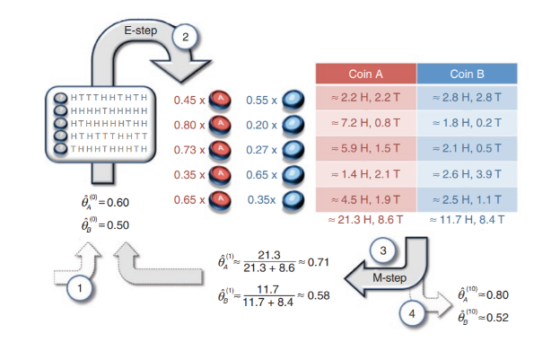
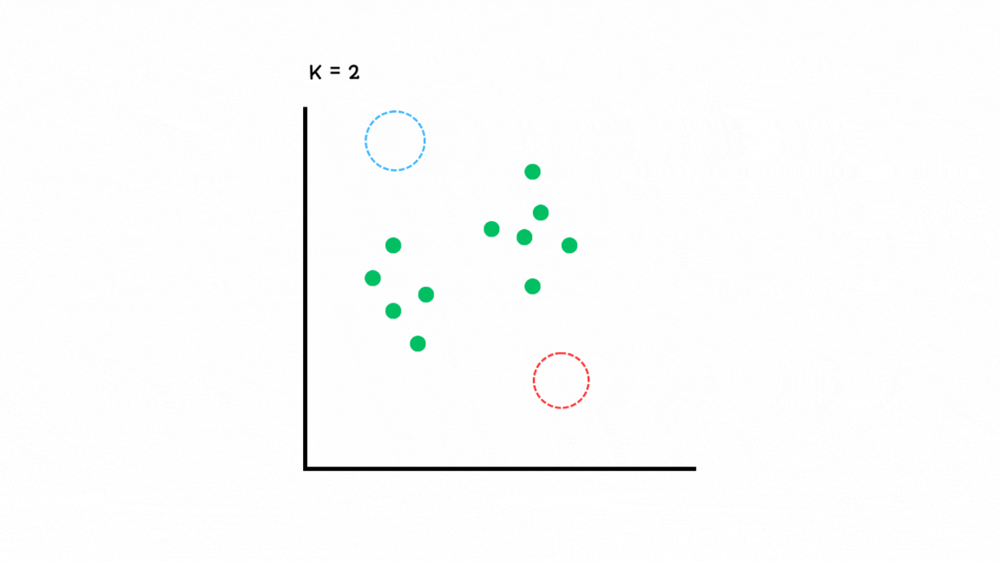

# GMM (Gaussian Mixture Model)

남성/여성, 반, 브랜드와 같이 우리가 주로 접할 수 있는 데이터는 대체로 '레이블'이 존재한다. 레이블은 데이터를 동일한 집합으로 묶어주는 역할을 수행한다. 어느정도 동질성을 갖는 데이터들은 동일한 레이블에 분류된다.

하지만, 데이터는 주어져 있으나, 레이블이 몇 개인지, 그리고 어떤 데이터가 어떤 군집을 이루는지 알 수 없는 경우도 있을 것이다. 예를 들어, 왓챠와 같은 OTT 서비스의 유저 이용 기록을 생각해보자. 연령과 성별, 사용언어, 거주지, 선호 장르에 따라 유저들을 군집화하여 레이블링한다면 유저들의 취향과 특성에 적합한 영상을 추천하거나, 비슷한 취향을 갖는 유저들이 즐겼던 영화를 다른 유저에게도 추천하는 것이 가능할 것이다.

레이블링을 위한 군집화는 어떻게 하면 좋을까? 대표적인 군집화 알고리즘으로는 Gaussian Mixture Model과 K-Means Clustering이 있다. 임의의 군집 개수로부터 시작해 최적 군집의 개수를 구하고, 데이터를 군집화한다는 점에서는 공통적이지만, Gaussian Mixture Model은 가우시안 확률 모델을 데이터에 적용하여 최적 군집을 도출하고, K-Means는 임의의 중심점과 데이터와의 거리를 통해 최적 군집을 도출한다는 차이가 있다.

이번 챕터에서는 가우시안 확률 모델을 적용시켜가며 최적 군집을 도출하는 Gaussian Mixture Model(이하 GMM)을 자세히 알아보도록 하겠다.

GMM에 대해 자세히 알아보기 전에, GMM에서 등장하는 수학적 지식에 대해 간단히 짚고 가겠다. 아래의 내용은 [Perdue 대학 ECE 302 강의 노트](https://engineering.purdue.edu/ChanGroup/ECE302/files/Slide_6_03.pdf)과 [스탠포드 대학 CS229 강의 노트](https://cs229.stanford.edu/notes2021fall/cs229-notes8.pdf)을 참고하여 작성하였다.

## 1. Jensen's inequality (젠슨부등식)

젠슨 부등식은 일종의 Convex 함수와 Concave 함수에 대해 성립하는 일종의 공리이다. 젠슨 부등식에 기반하여 직접 계산하기 어려운 부분에 대해 비교적 계산이 용이한 방식으로 해를 도출하는 것이 가능하다.

젠슨 부등식은 간단하게 말해, 어떠한 Convex 함수에 대해서, 함수 치역의 평균값은 정의역의 평균값에 대한 함수값보다 항상 크거나 같다는 것이다.

수식으로 보면 아래와 같다.

$$
f(\lambda x_1 + (1-\lambda)x_2) \leq \lambda f(x_1) + (1-\lambda)f(x_2)
$$

람다니 뭐니 직관적으로 안 들어온다면 이렇게 생각해도 좋다.

$$
f(\bar x) \leq \lambda f(x_1) + (1-\lambda)f(x_2)
$$

젠슨 부등식은 사실 이미 배운 적이 있다. **제곱의 평균은 평균의 제곱보다 항상 크거나 같다**($E(\bar x)^2 \geq E(\bar x^2), E(\bar x)^2 - E(\bar x^2)\geq 0$)가 바로 젠슨 부등식이 적용된 사례이다. 

젠슨 부등식을 그래프 상으로 나타내면 이해가 더 쉽다.

그림에서 이해할 수 있다시피, 젠슨 부등식은 오직 Convex, Concave 형태를 갖는 함수에서만 성립한다.

## 2. Expectation Maximization (기댓값 최대화)

관측 불가능한 어떠한 요소가 있고, 아무튼 그 관측 불가 요소에 대한 어떤 값의 분포만을 확인할 수 있는 경우에는 세 가지 방법으로 관측 불가능한 값을 추정할 수 있다. 이러한 관측 불가 값을 hidden variable(또는 Latent Variable)이라고 한다.

관측 불가 값 추정 방법은 데이터의 특성에 따라 나뉜다. 실시간으로 데이터가 변화하는 time sequence 데이터에 대해서는 마르코프 연쇄가 활용된 HMM을 사용한다. 쉽게 생각하면, 요즘의 Chat GPT와 같은 언어모델에 적용되는 확률 모델이 바로 HMM이다. LLM의 원리에 대해선 LLM 챕터에서 더 자세히 다루므로 넘어가겠다. 또 다른 하나는 조건부에 따라 확률 모델을 달리 구하는 Lagrangje Multiplier(라그랑제 승수법) 방식이 있다. 라그랑제 승수법은 제약조건에 따른 최대/최소값을 구하는 방법이다. 

마지막으로 Expectation Maximization은 말 그대로 기댓값을 구하는 함수를 목적함수로 정의하고 해당 함수의 기댓값이 최대가 되는 지점을 찾는 방법이다. 앞, 뒷면의 재질이 서로 다른 종류로 이뤄진, 두 종류의 동전 A, B 가 있다고 할 때, 각 동전을 시행마다 10회 던지는 것을 5회 수행한다고 생각해보자. 이때 만일 시행마다 던지는 동전을 알 수 있다면, 각 동전의 앞면이 나올 확률을 구하는 방법은 쉬울 것이다. 그냥 각 동전의 전체 던진 횟수에서 앞면이 나온 경우를 세기만 하면 된다.

하지만 만일 각 시행마다 어떤 동전을 던졌는지 알 수 없다면, 이때는 어떻게 각 동전의 앞면이 나올 확률을 구할 수 있을까? 이에 대한 해법이 바로 Expectation Maximization이다. Expectation Maximization에서 구하는 해법은, 각각의 동전이 앞면이 나올 확률이 최대가 될 때의 각 동전의 시행 횟수와 각 동전의 앞면이 나올 확률 분포(평균, 분산)를 구한다. 이 문제의 풀이 과정에 대한 도식은 아래 그림과 같다.

수식으로 이를 표현하기 전에 간단하게 어떤 변수가 매개변수가 되고, 어떤 수식을 최적화 할 것인지 생각해보자. 우선 최적화 대상이 될 매개변수는 코인 A의 던진 횟수, 코인 B의 던진 횟수, A 동전의 앞면이 나올 확률 분포, B 동전의 앞면이 나올 확률 분포이다. 

각 시행에서 어떤 동전을 던진 것인지 알 수는 없지만, 동전이 몇번 앞면이 나왔는지에 대해서는 관측할 수 있다. 따라서, 여기서 각 시행에서 던진 동전의 종류가 곧 숨겨진 상태, 즉 **Hidden State** 인 것이다. 

예를 들어 첫 번째 시행에서 시행결과가 $X_i=[H T T T H H T H T H ]$ 라고 했을 때, 이때 동전의 앞면이 나올 확률값은 쉽게 0.5라고 답할 수 있을 것이다. 하지만, 이는 어디까지나 **동전 S일 때 동전이 앞면일 확률**이다. 즉 앞선 확률값을 수식으로 표현하면 $P(X_i | S)$이다. 

그럼 이제 이 문제를 하나씩 수식으로 나타내보자. 동전 A가 앞면이 나올 확률을 $\theta_A$, 동전 B가 앞면이 나올 확률을 $\theta_B$라고 나타내고, 각 동전의 시행횟수를 $z_A$, $z_B$로 나타내보자. 최적화의 대상이 되는 식은 아래와 같다. 이때 $K$는 동전의 개수를 의미하며, $X_k^{(i)}$는 각 시행에서 나타나는 10회의 동전 던지기 결과 시퀀스를 의미한다. $\mathbb{X}$는 $X_K^{(i)}$의 총 집합을 나타낸다.

$$
\prod_{k=1}^{K} P(\mathbb{X} | z_k ; \theta_k) = \prod_{k=1}^K P(\mathbb{X}|\theta_k) \cdot P(z_k) = \prod_{k=1}^K P(\mathbb{X}|\theta_k) \prod_{k=1}^K P(z_k)
$$ 

여기서 각 코인의 시행 확률에 대한 $z_k$는 각 동전의 앞면이 등장할 확률을 통해 구할 수 있다. 이 문제에서는 동전의 종류가 2개 뿐이므로 간단히 $P(z_k)$를 구할 수 있다.

$$
P(z_A^{(i)}) = \frac{P(X_i | \theta_A)}{P(X_i | \theta_A) + P(X_i | \theta_B)} = \pi_A^{(i)}
$$

$$
P(z_B^{(i)}) = \frac{P(X_i | \theta_B)}{P(X_i | \theta_A) + P(X_i | \theta_B)} = \pi_B^{(i)}
$$

이제 $\theta_A$, $\theta_B$에 임의의 값을 부여해 기댓값을 구해보도록 하자. 초기값은 앞선 그림에 나타난 대로, $\hat\theta_A=0.6$, $\hat\theta_B = 0.5$로 설정한다. 

과정은 $p(z)$ 산출하는 E-step과, 산출된 $z$값을 바탕으로 다시 매개변수 값을 구하는 M-step으로 구성된다.

> **E-Step**

시행 1부터 하나씩 구해보자. 총 던진 횟수는 10회였다. 우선 $P(z_A^{(1)}), P(z_B^{(1)})$부터 구해보자.

$$
P(X_i|\theta_A) = (\theta_A)^5*(1-\theta_A)^5 =7.962624\times10^{-4} 
$$

$$
P(X_i|\theta_B) = (\theta_B)^5*(1-\theta_B)^5 =9.765625\times10^{-4} 
$$

위의 값으로 $P(z_A^{(1)}), P(z_B^{(1)})$을 구하면 각각 0.44, 0.55가 도출된다. 이와 같은 방법으로 1부터 5까지의 시행에 대해 구해주면 된다. 수식으로 이 과정을 나타내면 아래와 같다. 

$$
P(X_i | \theta_k) = \prod_{j=1}^{10}(\hat\theta_k)^{x_j}\cdot(1-\hat\theta_k)^{1-{x_j}} 
$$

$$
P(z_{ik}) = \frac{P(X_i | \theta_k)}{\sum_{k=1}^2P(X_i | \theta_k)}= \frac{\prod_{j=1}^{10}(\hat\theta_k)^{x_j}\cdot(1-\hat\theta_k)^{1-{x_j}} 
}{\prod_{j=1}^{10}\sum_{k=1}^2(\hat\theta_k)^{x_j}\cdot(1-\hat\theta_k)^{1-{x_j}} }
$$

$x_j$는 시행 $i$에서 $j$번째 요소가 앞면인지, 뒷면인지를 나타내는 값으로 앞면인 경우 1, 뒷면인 경우 0으로 나타난다. 따라서 앞면이 아닌 경우는 0의 값을 갖게되어, 앞면인 경우의 확률값은 1로 무시되고, 뒷면의 경우만 곱해지도록 풀이할 수 있다.

이제 구해진 $z_{ik}$값으로 기댓값을 구할 수 있다. hidden state 확률에 사전확률 $\pi^{z_{ik}}$를 곱함으로써 기댓값을 얻을 수 있다.

$$
E(\pi^{z_{ik}};z_{ik}) = \pi^{z_{ik}}*P(z_{ik})
$$

이를 좀 더 풀어보면 아래와 같다.
$$
\pi^{z_{ik}} = \frac{N_i}{N}
$$
$$
E(\pi_{ik};z_{ik}) = N*\pi^{z_{ik}}*P(z_{ik}) = N*\frac{N_i}{N}*\frac{\prod_{j=1}^{10}(\hat\theta_k)^{x_j}\cdot(1-\hat\theta_k)^{1-{x_j}} 
}{\prod_{j=1}^{10}\sum_{k=1}^2(\hat\theta_k)^{x_j}\cdot(1-\hat\theta_k)^{1-{x_j}} }
$$

$$
= N_i*\frac{\prod_{j=1}^{10}(\hat\theta_k)^{x_j}\cdot(1-\hat\theta_k)^{1-{x_j}} 
}{\prod_{j=1}^{10}\sum_{k=1}^2(\hat\theta_k)^{x_j}\cdot(1-\hat\theta_k)^{1-{x_j}} }
$$
> **M-Step**

E-Step에서는 임의의 예측 매개변수 $\theta_A,\theta_B$를 활용해 숨겨진 변수 $z_{ik}$의 값을 구할 수 있었다.  M-Step에서는 구한 $z_{ik}$를 조건부 확률에 적용하여 숨겨졌던 조건값에 따른 실제 표현값의 기댓값을 계산한다. 즉, M-Step부터는 $E(\mathbb{X}|\mathbb{Z} ; \Theta)$를 구하게 된다는 것이다. 각각의 조건값에 따른 기댓값으로 $\theta_A, \theta_B$를 다시 구한다.

갱신된 $\hat\theta_A, \hat\theta_B$를 구하기 위해서는 현재의 $\theta_A, \theta_B$에 대한 기댓값 뿐만 아니라 $(1-\theta_A), (1-\theta_B)$에 대한 기댓값도 구해야 한다. $\theta_A, \theta_B$는 전체 던진 횟수에 대한 앞면이 나올 확률을 의미하기 때문이다. 따라서 $\theta_A$와 $1-\theta_A$에 대한 기댓값을 모두 구하여 더한 후, $\theta_A$에서 두 값의 합을 나눔으로써 갱신된 $\theta_A$를 구할 수 있다.

$$
p(\mathbb X | Z_A) = \hat \theta_A^{(1)} = \frac{\sum_{i=1}^5 E(\pi_{iA};z_{iA})}{\sum_{i=1}^5 E(\pi_{iA};z_{iA})+\sum_{i=1}^5 E(1-\pi_{iA};z_{iA})} = \sum_{i=1}^5\frac{N_i}{N}p(z_{iA})
$$

$$
p(\mathbb X | Z_B) = \hat \theta_B^{(1)} = \frac{\sum_{i=1}^5 E(\pi_{iB};z_{iB})}{\sum_{i=1}^5 E(\pi_{iB};z_{iB})+\sum_{i=1}^5 E(1-\pi_{iB};z_{iB})} = \sum_{i=1}^5\frac{N_i}{N}p(z_{iB})
$$

$P(\mathbb X|\mathbb Z)$은 두 확률의 곱으로 나타낼 수 있다.

$$ 
P(\mathbb X | \mathbb Z) = p(\mathbb X | Z_A) p(\mathbb X | Z_B) = 

\prod_{k=i}^2\sum_{i=1}^{5}\frac{N_i}{N}*\frac{\prod_{j=1}^{10}(\hat\theta_k)^{x_j}\cdot(1-\hat\theta_k)^{1-{x_j}} 
}{\prod_{j=1}^{10}\sum_{k=1}^2(\hat\theta_k)^{x_j}\cdot(1-\hat\theta_k)^{1-{x_j}} }
$$

$$
= \prod_{k=i}^2\sum_{i=1}^{5}\frac{N_i}{N}\prod_{j=1}^{10}\frac{(\hat\theta_k)^{x_j}\cdot(1-\hat\theta_k)^{1-{x_j}} 
}{\sum_{k=1}^2(\hat\theta_k)^{x_j}\cdot(1-\hat\theta_k)^{1-{x_j}} }
$$

$\theta_A, \theta_B$가 더이상 증가하지 않을 때까지 E-M step을 반복한다.

## 3. Gaussian Mixture Model

가우시안 혼합 모델 (Gaussian Mixture Model)은 단어 그대로 가우시안 확률 분포가 여러개 혼합되어있는 모델이다. 그 말인 즉슨, 특정한 X값에 대해 개별 클래스(레이블)에 대한 가우시안 모델이 여러개 겹쳐 있다는 상태라는 것이다. 예를 들어 키의 경우, 172cm라는 값에 대해 여성의 키일수도 있고, 남성의 키일수도 있다고 추정할 수 있을 것이다. 그리고 이는 곧 가능성(확률)로 설명될 것이다. 남성일 확률 56%, 여성일 확률 44% 처럼 말이다.

이렇듯, 어떤 데이터값을 레이블(클래스)의 혼합으로 설명하는 모델이 바로 Generative Model이다. 이와 반대되는 개념으로는 Discriminate Model이 있다. discriminate model은 말 그대로, 어떤 데이터를 꼭 하나의 클래스로 분류하는 모델이다.

여기서 잠깐 언어 모델이 떠오르기도 할 것이다. transformer의 경우에도 (조금 응용된 형태이긴 하지만) 특정 단어 다음에 올 단어들을 확률 순으로 나열하기 때문이다. 이 과정에서 실시간적으로 현재 토큰에 대해 다음에 올 토큰들의 확률을 계산한다. 그러니까, 언어모델에서는 현재 토큰 다음에 있는 빈 칸이 곧 여러개의 클래스(토큰)가 확률로 혼합되어 나타나는 데이터 포인트인 것이다.

이러한 생성형 모델이 근간으로 두고 있는 알고리즘이 바로 EM이다. EM은 각 클래스의 존재 비율과 각 클래스가 이루는 정규 분포를 알 수 없을 때, **1. 임의의 초기 파라미터값을 활용해 클래스별 비율을 구하고 (E-Step)** 베이지안 추정법을 통해 **2. 개별 데이터값의 클래스별 확률합에 대한 전체 합을 구하고, 해당 식을 목적함수로 하여 파라미터로 미분하여 파라미터를 갱신 (M-Step)** 한다, 이때 총 클래스 개수인 K값 역시 알 수 없으므로 적절한 K값이 나올 때까지 이 과정을 반복한다. 

> **E-Step**

$\pi_k$는 해당 클래스가 전체 클래서에서 차지하는 비율을 의미한다. 따라서 모든 $\pi_k$의 합은 1이다. $\pi_k$는 가중치와 같이 기능한다. $\pi_k$는 분명히 존재하는 값이고, 고정된 값이나 현 시점에서 알 수 없는 Latent Variable이다. 따라서 이 값을 고정적인 비율값으로 보고 상수로 취급한다. 비율값을 의미하므로 전체 $\pi_k$의 합은 1이다. 아무튼 이 정규분포에 대한 가중치인 $\pi_k$를 현재 시점에서는 알 수 없으니 random한 상수 세트 $\phi$로 시작한다. $\phi$는 $K$개의 레이블에 대한 데이터 임의의 데이터 비율 집합이다.

전체 데이터세트 $\mathbb X = [X^{(1)}, X^{(2)} , ... , X^{(N)}]$이라고 할 때, 데이터 $X^{(i)}$가 갖는 확률 분포는 아래의 식과 같다.
$$
P(X^{(i)}) = \sum_{j=1}^K\pi_j N(\mu_j, \Sigma_j) = \sum_{j=1}^K P(X^{(i)}|\pi_j, \mu_j,\Sigma_j)
$$
즉, $X_i$의 확률분포는 정규분포의 가중합의 형태로 나타난다. 전체 데이터에 대한 우도는 아래 식과 같다.

$$
P(\mathbb X | \Theta) = \prod_{i=1}^N\sum_{j=1}^K P(X^{(i)}|\pi_j, \mu_j,\Sigma_j) = \prod_{i=1}^N\sum_{j=1}^K P(X^{(i)}|\theta_j) 
$$

자연상수가 있고 확률곱이 포함된 식이므로 최적값을 구하기 어렵다. 따라서 해당 식에 log를 취해 따라서 log-likelihood 형태로 변형한다.

$$
ln\space P(\mathbb X | \Theta) = \sum_{i=1}^Nln\space\sum_{j=1}^K(P(X^{(i)} | \theta_j))
$$

로그를 취하면 로그가 여전히 덧셈 기호 바깥에 남아있는 문제가 있다. 로그에 합 연산이 있는 형태는 미분이 매우 어렵다. 따라서 계산을 가능하게 할 수 있도록 식을 더 정리한다. 이때 젠슨 부등식 개념이 적용된다. 즉, 해당 식을 기댓값 식의 형태로 변형하여 젠슨 부등식을 적용할 수 있도록 형태를 변환한다.

이 식에서는 $K$가 카테고리의 개수이다. 즉, $P(X^{(i)} | \theta_j)$는 데이터 $X_i$가 어떤 카테고리 $z$에 속할 확률들의 합을 의미한다. 그러니까, $(\pi_j, \mu_j, \Sigma_j)$로 구성된 $\theta_j$일 때, X가 갖는 확률이라는 뜻이다. 

앞서서 우리는 $\pi_j$가 어떤 값인지 알아봤다. 카테고리별로 임의의 정규분포($\mu_j,\Sigma_j$)를 이룰 때, 이때 해당 정규분포에서 $X_i$가 특정 카테고리에 속할 확률을 구했고, 이는 $\gamma_k =  P(X^{(i)}|\mu_k, \Sigma_k),\pi_k= \frac{ \gamma_k}{\sum_{k=1}^K\gamma_k}$로 구할 수 있었다. 즉, $\pi$값은 $\mu,\Sigma$에 따라 결정되는 값이므로 사실상 상수 취급을 받는다. 

아무튼 $P(X^{(i)}|\pi_j,\mu_j,\Sigma_j)$에서 $\pi$는 joint된 확률이다. $\pi$에 대한 확률을 분리하기 위해, 이를 조건부확률식으로 다시 나타내면 아래의 식을 얻을 수 있다. 이 식에서 나오는 $\theta$는 $\pi$가 제외된 집합이다.

$$
\sum_{i=1}^Nln\sum_{j=1}^K P(X^{(i)} | z_j=j, \theta_j)P(z_j=j)
$$

다시 젠슨 부등식에 대한 이야기로 돌아가자. 이제 위의 식을 기댓값 식의 형태로 변환하여 젠슨부등식을 적용해야 한다. 조건부 확률의 기댓값은 영향을 주는 조건변수와 영향을 받는 확률 변수를 반대로 바꿈으로써 구할 수 있다.(?) 이때 값에 변화를 주는 것이 아닌 형변환만 하는 것이므로 역수값을 곱해준다. 편의에 따라 $P(z_j|X^{(i)}, \theta_j)$를 $Q(z_j)$로 표기하기도 한다.

$$
\sum_{i=1}^Nln\sum_{j=1}^K P(z_j | X^{(i)},\theta_j) \frac{P(X^{(i)} | z_j=j, \theta_j)P(z_j=j)}{P(z_j | X^{(i)},\theta_j)}
$$

수식이 복잡하니 일단 $\sum_{j=1}^K P(z_j | X^{(i)},\theta_j) \frac{P(X^{(i)} | z_j=j, \theta_j)P(z_j=j)}{P(z_j | X^{(i)},\theta_j)} = P$라고 두고 생각해보자. $P = E(P(X^{(i)},z_j ))$ 형태이므로 $ln(E(P(X^{(i)},z_j ))) \geq E(ln(P(X^{(i)},z_j )))$ 관계가 성립한다. (로그 함수가 concave이므로 이렇게 부호가 앞서 언급한 수식과 반대이다.)

정리하면 아래와 같다.

$$
\sum_{i=1}^Nln\sum_{j=1}^K P(z_j | X^{(i)},\theta_j) \frac{P(X^{(i)} | z_j=j, \theta_j)P(z_j=j)}{P(z_j | X^{(i)},\theta_j)} \geq \sum_{i=1}^N\sum_{j=1}^K ln(P(z_j | X^{(i)},\theta_j) \frac{P(X^{(i)} | z_j=j, \theta_j)P(z_j=j)}{P(z_j | X^{(i)},\theta_j)})
$$

로그가 적용되므로 곱셉식은 덧셈으로 바뀐다. 따라서 최종적으로 아래의 식이 도출된다. 이 식을 최대화 하는 $\theta_j$를 찾아야 한다.

$$
\sum_{i=1}^N(\sum_{j=1}^K ln(P(z_j | X^{(i)},\theta_j)) + \sum_{j=1}^K  ln(\frac{P(X^{(i)} | z_j=j, \theta_j)P(z_j=j)}{P(z_j | X^{(i)},\theta_j)}))
$$

> **M-Step**

$z_j$는 사실상 비율값이므로 상수다. 따라서 $\sum_{j=1}^K ln(P(z_j | X^{(i)},\theta_j))$는 상수 취급을 받는다. 따라서 최종적으로 미분을 적용해 최적화 할 식은 아래와 같다.

$$
 \sum_{i=1}^N\sum_{j=1}^K  ln(\frac{P(X^{(i)} | z_j=j, \theta_j)P(z_j=j)}{P(z_j | X^{(i)},\theta_j)})
$$

이렇게 되면 새로운 $\mu, \Sigma$가 구해지면서 $\pi$도 갱신된다. 가우시안 혼합 모델 자체의 형태가 convex나 concave가 아니므로, global optimum을 구하는 것은 불가능하다. 다만, 여러번 매번 $\phi$를 갱신하며 E-M step을 반복하다 보면 어느 순간부터는 값이 거의 증가하지 않을 때가 있을 것이다. 이때를 local optimum으로 선택 할 수는 있다. 시각적으로 아래 과정을 보면 아래와 같다.

