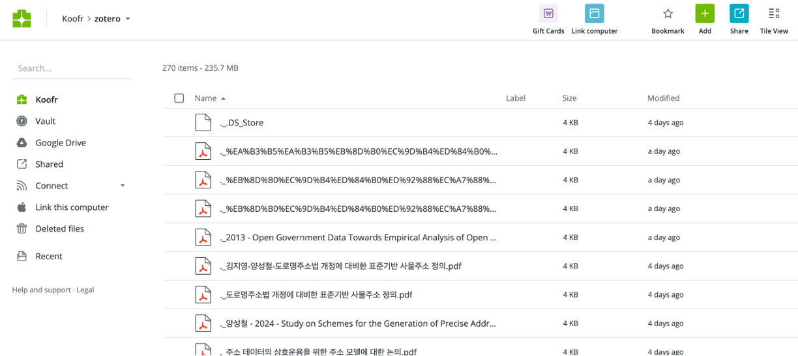

# Zotero에 Koofr 연동하기

:::info
본 내용은 chanmuzi 님의 블로그를 참조하여 작성하였습니다. 
https://chanmuzi.tistory.com/489
:::

로컬과 연결된 구글 드라이브를 사용하면 webDav 설정 없이 쉽게 클라우드 환경에 연동할 수 있으나, 이 경우 모바일 zotero 앱에서 원본 pdf 파일을 바로 확인할 수 없다. 모바일에서도 PC에서처럼 논문을 보고 싶으면 webDav로 동기화 설정을 해야한다. Synology를 사용할 수도 있지만 그런게 없는 상황이라면 Koofr를 고려해볼 수 있다. Koofr는 무료로 10Gb정도 사용할 수 있다.

### 1. ZotMoov 설치

ZotMoov는 ver 7에서 동작하는 동기화 관련 플러그인이다. [여기](https://github.com/wileyyugioh/zotmoov/releases/tag/1.2.10)서 `.xpi` 파일을 다운받고, zotero에서 plugin으로 적용하면 된다. plugin 적용 방법은 [여기](https://blog.harampark.com/blog/zotero-setting/)를 참고하면 된다. 이 블로그에서는 시놀로지로 WebDav 연결하는 방법도 소개하고 있으니, 시놀로지를 사용하고자 하는 경우는 이 블로그를 참고하자.

### 2. Koofr 가입

Koofr에 가입하고, Zotero와의 WebDav 연결을 위한 비밀번호를 발급받는 과정은 [이 블로그](https://chanmuzi.tistory.com/489)를 따라하면 된다.

### 3. WebDav 설정

`환경설정 > 동기화`에서 아래 사진과 같이 설정을 변경하면 된다. URL은 `app.koofr.net/dav/Koofr` 를 입력하면 된다. 

사용자명은 Koofr 가입 시 사용한 이메일을, 비밀번호는 앞선 과정에서 발급받은 비밀번호까지 모두 입력하면 된다.

꼭 서버검증 버튼을 눌러서 잘 연결되었는지 확인하자.

---

이제 zotero쪽에 논문을 업로드하면 자동으로 Koofr 서버에도 저장이 된다. 단점이 있다면 Koofr에는 다운로드 받을 당시 원본 파일 명 그대로 저장되므로, Koofr에서 논문을 찾기가 불편하다는 것이다. Koofr를 통한 webDav 연동은 모바일 Zotero로 논문을 읽고자 하는 경우에만 권장한다.

모바일 환경에서 zotero를 사용할 때에는 Attachment란에 있는 PDF 파일을 클릭하면 바로 Koofr 서버에서 로컬 환경(모바일)으로 다운로드 된다.
